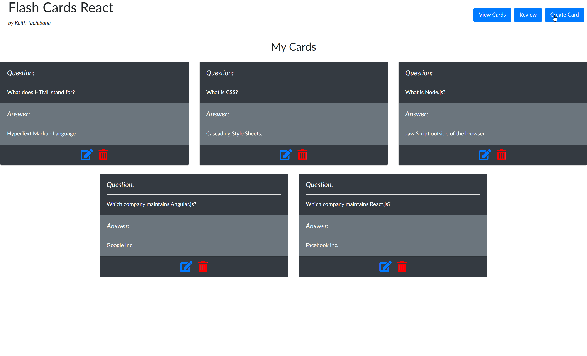

# Flash Cards React
A front-end application that serves as a study aid through the creation of flash cards for memorizing definitions, words, concepts, acronyms, etc.
## Technologies Used
|                 Dependency          |    Version    |
|-------------------------------------|--------------:|
| @Babel/Core                         |     7.8.6     |
| @Babel/Plugin-Transform-React-JSX   |     7.8.3     |
| Babel-Loader                        |     8.0.6     |
| Bootstrap                           |     4.4.1     |
| FontAwesome                         |     5.9.0     |
| React                               |    16.13.0    |
| React-DOM                           |    16.13.0    |
| Reactstrap                          |     8.4.1     |
| Webpack                             |     4.42.0    |
| Webpack-CLI                         |     3.3.11    |
| Webpack-Dev-Server                  |     3.10.3    |
## Live Demo
Try the application live on [my porftolio website](https://www.keith-tachibana.com/portfolio/flashCards/dist/index.html)
## Features
- _*_ User can create flash cards consisting of a front-side (question) and back-side (answer)
- _*_ User can view all flash cards at once on a single, summary page
- _*_ User has the option to edit or delete each card on the summary page
- _*_ User can test his/her knowledge of the flash cards by going to the review page
- _*_ User can skim through all the cards on the review page and click on each one to flip it and reveal the answer
- _*_ User can still see the flash cards upon exiting the browser thanks to the utilization of local storage
## Preview

## Development
#### System Requirements
|    Requirement    |       Version       |
|-------------------|--------------------:|
| Node              |    10 or higher     |
| NPM               |     6 or higher     |
#### Getting Started
1. Clone the repoistory
  ```shell
  git clone https://github.com/Keith-Tachibana/Flash_Cards_React.git
  ```
2. Change directory to cloned folder
  ```shell
  cd Flash_Cards_React/
  ```
3. Install all dependencies with NPM
  ```shell
  npm install
  ```
4. Transpile React components and start dev server using Webpack
  ```shell
  npm run start
  ```
5. Open your default web browser and navigate to http://localhost:3009/ to see the result!
